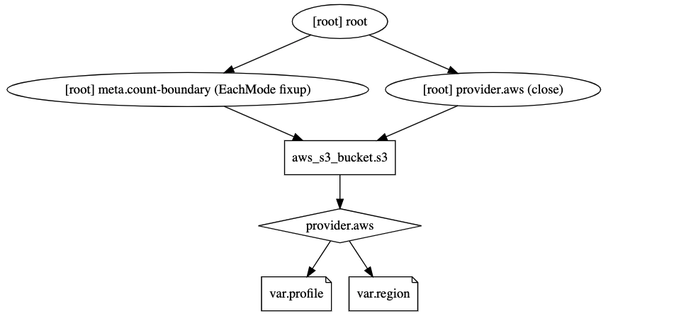

# terraform

## Explaining the `tf` command line

### Terraform Plan

`tf plan`
> Generates an execution plan for Terraform.
>
> This execution plan can be reviewed prior to running apply to get a
> sense for what Terraform will do. Optionally, the plan can be saved to
> a Terraform plan file, and apply can take this plan file to execute
> this plan exactly.

`tf plan -destroy`
>If set, a plan will be generated to destroy all resources
managed by the given configuration and state.

`tf plan -destroy -out file.name`
`tf plan -destroy -out s3_destroy.plan` and to view the plan `tf show s3_destroy.plan`

### Terraform State

Refers to the local configuration in TF code, but also refers to the infrastructure state in Cloud (AWS, Azure, etc) like IP's, hostnames etc.

`tf state`
> This command has subcommands for advanced state management.
>
> These subcommands can be used to slice and dice the Terraform state.
> This is sometimes necessary in advanced cases. For your safety, all
> state management commands that modify the state create a timestamped
> backup of the state prior to making modifications.
>
> The structure and output of the commands is specifically tailored to work
> well with the common Unix utilities such as grep, awk, etc. We recommend
> using those tools to perform more advanced state tasks.
>
>Subcommands:
    list    List resources in the state
    mv      Move an item in the state
    pull    Pull current state and output to stdout
    push    Update remote state from a local state file
    rm      Remove instances from the state
    show    Show a resource in the state
---

Example of the command and output

```bash
❯ tf state list
aws_s3_bucket.s3
```

To view the remote state what is storing and to what is referring use `tf state show <resource>`

```bash
❯  tf state show aws_s3_bucket.s3
# aws_s3_bucket.s3:
resource "aws_s3_bucket" "s3" {
    acl                         = "private"
    arn                         = "arn:aws:s3:::auggie-sandbox-tf-tests"
    bucket                      = "auggie-sandbox-tf-tests"
    bucket_domain_name          = "auggie-sandbox-tf-tests.s3.amazonaws.com"
    bucket_regional_domain_name = "auggie-sandbox-tf-tests.s3.us-east-2.amazonaws.com"
    force_destroy               = false
    hosted_zone_id              = "Z2O1EMRO9K5GLX"
    id                          = "auggie-sandbox-tf-tests"
    region                      = "us-east-2"
    request_payer               = "BucketOwner"

    versioning {
        enabled    = false
        mfa_delete = false
    }
}
```

### Terraform Graph

`tf graph`
> Outputs the visual execution graph of Terraform resources according to
  configuration files in DIR (or the current directory if omitted).
>
> The graph is outputted in DOT format. The typical program that can
  read this format is GraphViz, but many web services are also available
  to read this format.
>
> The  The -type flag can be used to control the type of graph shown. Terraform
  creates different graphs for different operations. See the options below
  for the list of types supported. The default type is "plan" if a
  configuration is given, and "apply" if a plan file is passed as an
  argument.
>
> Options:
>
> -draw-cycles     Highlight any cycles in the graph with colored edges.
                   This helps when diagnosing cycle errors.
>
> -type=plan       Type of graph to output. Can be: plan, plan-destroy, apply,
> validate, input, refresh.
>
> -module-depth=n  (deprecated) In prior versions of Terraform, specified the
> depth of modules to show in the output.

Example:

```bash
❯ tf graph
digraph {
        compound = "true"
        newrank = "true"
        subgraph "root" {
                "[root] aws_s3_bucket.s3" [label = "aws_s3_bucket.s3", shape = "box"]
                "[root] provider.aws" [label = "provider.aws", shape = "diamond"]
                "[root] var.profile" [label = "var.profile", shape = "note"]
                "[root] var.region" [label = "var.region", shape = "note"]
                "[root] aws_s3_bucket.s3" -> "[root] provider.aws"
                "[root] meta.count-boundary (EachMode fixup)" -> "[root] aws_s3_bucket.s3"
                "[root] provider.aws (close)" -> "[root] aws_s3_bucket.s3"
                "[root] provider.aws" -> "[root] var.profile"
                "[root] provider.aws" -> "[root] var.region"
                "[root] root" -> "[root] meta.count-boundary (EachMode fixup)"
                "[root] root" -> "[root] provider.aws (close)"
        }
}
```

By Copy/Pasting the `tf graph` command output to a site <http://webgraphviz.com/>
You can see the graph


---

### Terraform Apply

`tf apply`
> Builds or changes infrastructure according to Terraform configuration
  files in DIR.
>
> By default, apply scans the current directory for the configuration
  and applies the changes appropriately. However, a path to another
  configuration or an execution plan can be provided. Execution plans can be
  used to only execute a pre-determined set of actions.

Example of using the command `tf apply` with the plan which been generated before `tf apply s3_destroy.plan`
**Note that the apply command will not ask you for execution, it will execute straight away the plan**

```bash
❯ tf apply s3_destroy.plan
aws_s3_bucket.s3: Destroying... [id=auggie-sandbox-tf-tests]
aws_s3_bucket.s3: Destruction complete after 1s

Apply complete! Resources: 0 added, 0 changed, 1 destroyed.
```

and if you want to execute the plan again TF will inform you that the plan is _**Stale**_

```bash
❯  tf apply s3_destroy.plan

Error: Saved plan is stale

The given plan file can no longer be applied because the state was changed by
another operation after the plan was created.
```

Even if you recreate the s3 bucket from same code by doing `tf apply` you will not be able to use the same plan again.

```bash
❯ tf apply

An execution plan has been generated and is shown below.
Resource actions are indicated with the following symbols:
  + create

Terraform will perform the following actions:

  # aws_s3_bucket.s3 will be created
  + resource "aws_s3_bucket" "s3" {
      + acceleration_status         = (known after apply)
      + acl                         = "private"
      + arn                         = (known after apply)
      + bucket                      = "auggie-sandbox-tf-tests"
      + bucket_domain_name          = (known after apply)
      + bucket_regional_domain_name = (known after apply)
      + force_destroy               = false
      + hosted_zone_id              = (known after apply)
      + id                          = (known after apply)
      + region                      = (known after apply)
      + request_payer               = (known after apply)
      + website_domain              = (known after apply)
      + website_endpoint            = (known after apply)

      + versioning {
          + enabled    = (known after apply)
          + mfa_delete = (known after apply)
        }
    }

Plan: 1 to add, 0 to change, 0 to destroy.

Do you want to perform these actions?
  Terraform will perform the actions described above.
  Only 'yes' will be accepted to approve.

  Enter a value: yes

  aws_s3_bucket.s3: Creating...
aws_s3_bucket.s3: Still creating... [10s elapsed]
aws_s3_bucket.s3: Creation complete after 12s [id=auggie-sandbox-tf-tests]

Apply complete! Resources: 1 added, 0 changed, 0 destroyed.
```

and now let run again same command `tf apply s3_destroy.plan` you will get same error:

```bash
❯ tf apply s3_destroy.plan

Error: Saved plan is stale

The given plan file can no longer be applied because the state was changed by
another operation after the plan was created.
```

We would need to generate new plan to be able to deploy.

---

## Next Section

### [Infrastructure as Code](./tf_infra_as_code.md)
